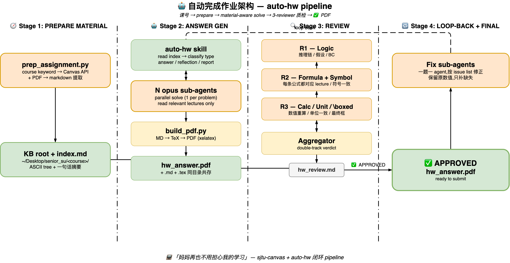

# 📚 sjtu-canvas

> ### 📺 「妈妈再也不用担心我的学习」
>
> *—— 让 Claude Code 接管 Canvas，作业 · 公告 · DDL · 课件全自动汇总，推到你的 Google Calendar / Notion / Obsidian Dashboard。*

```text
   ┌─────────────────────┐      ┌──────────────────┐      ┌────────────────────┐
   │  Canvas LMS         │      │  Claude Code     │      │  Google Calendar   │
   │  oc.sjtu.edu.cn     │ ───▶ │  · OpenCode      │ ───▶ │  Notion DB         │
   │  作业/公告/DDL/课件 │      │  (sjtu-canvas)   │      │  Obsidian Dashboard│
   └─────────────────────┘      └──────────────────┘      └────────────────────┘
            数据源                  统一 AI 入口                可视化输出
```

> 默认配置 SJTU（`oc.sjtu.edu.cn`），改一行 `base_url` 兼容任何 Canvas LMS。
> 🍴 Fork of [xhh678876/sjtu-canvas](https://github.com/xhh678876/sjtu-canvas) —— 修了 upstream 的 `submit_assignment` SyntaxError、加了跨课程动向/公告汇总、agent memory、syllabus 自动定位。

## 🎒 它能干啥

| 模块 | 一句话 |
|---|---|
| 🌊 **近期动向流** | 跨所有课程拉 activity_stream（公告 / 新作业 / 讨论 / 评分变化），一次看完最近发生了什么 |
| 📢 **跨课程公告汇总** | 把所有 active 课程的 announcements 按时间窗（近 N 天）聚合 |
| 🧠 **Agent Memory** | 作业/公告状态本地存档（`state/memory.json`）。Canvas 是 source of truth，本地只做 overlay |
| 📂 **课件管理** | 查看 · 下载 · 批量下载课程文件（PPT/PDF/DOCX），支持近 N 天更新筛选 |
| 📄 **Syllabus 智能定位** | 自动搜 `*syllabus*.pdf`（适配 SJTU JI 习惯） |
| 🧠 **AI 课件总结** | PPT/PDF 提取为 Markdown，喂给 AI 出学习笔记 |
| 🎯 **作业辅导** | 自动抓作业要求 + 匹配课件内容 → 给思路 |
| 📝 **DDL 追踪** | 一条命令列出所有未来截止 |
| ⏰ **日历同步** | DDL → Apple 日历（macOS），自动 iCloud 推到 iPhone |
| 📊 **成绩查询** | 各科已出成绩 + 计算均分 |
| 💬 **讨论区摘要** | 抓课程讨论区内容 |
| 🚀 **提交作业** | 命令行直接交（已修 upstream 的 SyntaxError） |
| 📦 **复习包** | 批量导出所有课件为 Markdown，导入 NotebookLM / Obsidian 复习 |
| 🤖 **AI 解题 + 质检 pipeline**（via `skills/auto-hw`） | N 个 opus sub-agent 并行解题 → LaTeX 编译 → 3 reviewer 严格质检（逻辑 / 公式出处 / 算术-单位-\boxed）→ loop-back fix → ✅ APPROVED PDF。详见 [`skills/auto-hw/SKILL.md`](skills/auto-hw/SKILL.md) |

## 🤖 自动完成作业架构



一句话 `做 ME335 HW1` 触发,4 stages 自动跑完:

| Stage | 干啥 | 产物 |
|---|---|---|
| **🧭 1. PREPARE MATERIAL** | `prep_assignment.py` 跑 Canvas API 拉课程文件 → `file_extractor` 提 PDF → 生成 ASCII 树 `index.md` | KB root + `index.md`(auto-hw 兼容格式) |
| **🤖 2. ANSWER GEN** | auto-hw skill 读 `index.md` 分类作业类型 → 派 **N 个 opus sub-agent 并行解题**(每个只看相关 lecture)→ 主 controller 装配 → `build_pdf.py` 一行编译 | `hw{N}_answer.md` + `.tex` + `.pdf` |
| **🔍 3. REVIEW** | 3 个 reviewer **并行**严格质检:R1 逻辑链 / R2 公式出处 + 符号一致性 / R3 算术 + 单位 + `\boxed` 格式 → Aggregator 聚合 + double-track verdict | `hw{N}_review.md` |
| **🔁 4. LOOP-BACK + FINAL** | ✅ 全过 → 输出 PDF;⚠️ 有 issue → 派 **fix sub-agents** 重做问题题目 → 重新走 Stage 2-3 直到 ✅ | `✅ APPROVED hw{N}_answer.pdf` |

**实测端到端 ~3-4 分钟** (ME335 Assignment 1: 5 题 opus 并行解题 13s + 3 reviewer 并行 50s + loop-back fix 55s + 重 review 50s)。

> 详细 prompt 模板 / 符号陷阱清单 / verdict 规则见 [`skills/auto-hw/reviewer.md`](skills/auto-hw/reviewer.md)。

## 🛣️ Roadmap

| 集成 | 状态 |
|---|---|
| Apple Calendar（macOS，osascript） | ✅ shipped |
| Claude Code skill 加载 | ✅ shipped |
| OpenCode 兼容（via `$SJTU_CANVAS_CONFIG`） | ✅ 已兼容 |
| AI 解题 + 质检 pipeline（`skills/auto-hw`） | ✅ shipped |
| `prep_assignment.py` → `index.md` → auto-hw 衔接 | ✅ shipped |
| Google Calendar API 同步 | 🚧 设计中 |
| Notion DB 自动同步（via MCP） | 🚧 设计中 |
| Obsidian Daily Note 注入 | 🚧 设计中 |
| 跨 harness 通知（LINE / Telegram / 邮件） | 💭 在想 |

> 想优先看到哪个？提 issue 或直接 PR。

## 🚀 三分钟接管你的学期

### 1. Clone 到 Claude Code skills 目录

```bash
git clone https://github.com/1WesleyYou/sjtu-canvas.git ~/.claude/skills/sjtu-canvas
cd ~/.claude/skills/sjtu-canvas
```

或者放任意目录，然后用环境变量指向 config：

```bash
git clone https://github.com/1WesleyYou/sjtu-canvas.git ~/Desktop/sjtu-canvas
export SJTU_CANVAS_CONFIG=~/Desktop/sjtu-canvas/config.json
```

### 2. 填配置

```bash
cp config.example.json config.json
# 编辑 config.json，填入 canvas_token 和 base_url
```

### 3. 装依赖

```bash
pip3 install python-pptx pdfplumber requests
```

完事。Claude Code 会自动读 `SKILL.md` 的 frontmatter，对话里说"看一下我 Canvas 这周的动向"就触发。

## 🔑 获取 Canvas API Token

1. 浏览器登录 `https://oc.sjtu.edu.cn`（校外需 SJTU VPN）
2. 右上头像 → **Account** → **Settings**
3. 滚到 **Approved Integrations** → **+ New Access Token**
4. Purpose 随便填（如 `claude-code-canvas`），Expires 留空 = 永不过期
5. 点 **Generate Token**，**立刻复制**（只显示一次）
6. 粘贴到 `config.json` 的 `canvas_token` 字段

```json
{
  "canvas_token": "你的Token",
  "base_url": "https://oc.sjtu.edu.cn",
  "save_dir": "~/Downloads/Canvas课件",
  "calendar_name": "Canvas作业"
}
```

> 💡 非 SJTU 用户改 `base_url` 即可。
> 🔒 `config.json` 已在 `.gitignore`，不会被 commit。

## 💬 用起来长啥样

### 自然语言（在 Claude Code / OpenCode 里直接说）

```
"看一下我这周 Canvas 上发生了什么"     ← recent_activity
"最近的 DDL 有哪些？"                  ← get_all_upcoming_ddls
"拉一下 ECE2150 的 syllabus"          ← find_syllabus
"哪些课最近更新了 slides？"            ← recent_files
"下载 ME4950 的课件"
"帮我总结这个 PPT 的重点"
"这次作业考的是哪些知识点？"
"查看成绩"
"把 DDL 同步到日历"
```

### CLI（适合 cron / 脚本）

```bash
# 基础
python3 scripts/canvas_api.py courses          # 课程列表
python3 scripts/canvas_api.py me               # 当前用户
python3 scripts/canvas_api.py ddls             # 所有未来 DDL
python3 scripts/canvas_api.py grades           # 已出成绩

# 本 fork 新增
python3 scripts/canvas_api.py activity         # 近期动向（默认 30 条）
python3 scripts/canvas_api.py activity 50      # 指定条数
python3 scripts/canvas_api.py syllabus         # 各课 syllabus PDF
python3 scripts/canvas_api.py recent           # 近 7 天更新课件
python3 scripts/canvas_api.py recent 3         # 近 3 天

# 跨课程公告汇总
python3 scripts/canvas_api.py announcements    # 全部
python3 scripts/canvas_api.py announcements 7  # 近 7 天

# Agent Memory
python3 scripts/canvas_api.py sync                   # Canvas → state/memory.json
python3 scripts/canvas_api.py pending                # 未完成的事（7 天窗口）
python3 scripts/canvas_api.py pending 21             # 21 天窗口
python3 scripts/canvas_api.py mark <slug> completed  # 标记作业完成
python3 scripts/canvas_api.py mark <slug> acted_on   # 标记公告已处理

# 课件提取
python3 scripts/file_extractor.py path/to/lecture.pptx

# DDL → Apple Calendar
python3 scripts/calendar_sync.py
```

### Python API

```python
import sys; sys.path.insert(0, "scripts")
from canvas_api import *

list_courses()                          # 课程列表
list_assignments(course_id)             # 作业列表
get_all_upcoming_ddls()                 # 所有未来 DDL
get_course_grades(course_id)            # 成绩
list_course_files(course_id)            # 课程文件
download_course_files(cid, name, dir)   # 批量下载
list_discussions(course_id)             # 讨论区
submit_assignment(cid, aid, [paths])    # 提交作业

# 本 fork 新增
recent_activity(per_page=30)            # 跨课程动向流
recent_files(course_id, since_days=7)   # 近 N 天更新文件
find_syllabus(course_id)                # 搜 syllabus PDF
list_announcements(course_id)           # 单门课公告
all_announcements(since_days=7)         # 跨课程公告汇总
sync_state()                            # Canvas → state/memory.json

# Agent memory
import state
s = state.load_state()
state.list_pending_assignments(s, days_window=7)
state.list_pending_announcements(s, since_days=30)
state.mark_status(slug, "completed", notes="备注")
```

## 🏗️ 项目结构

```
sjtu-canvas/
├── SKILL.md              # Skill 触发定义（Claude Code 自动加载）
├── README.md
├── config.example.json   # 配置模板
├── config.json           # 你的实际配置（gitignored）
├── LICENSE
├── state/                # Agent memory（gitignored）
│   └── memory.json
├── scripts/
│   ├── canvas_api.py     # Canvas API 核心 + activity/syllabus/recent/sync
│   ├── state.py          # Agent memory: load/save/merge/mark
│   ├── file_extractor.py # PPT/PDF/DOCX → Markdown
│   ├── calendar_sync.py  # DDL → Apple Calendar（macOS）
│   └── prep_assignment.py# Canvas → KB root + index.md (衔接 auto-hw)
└── skills/
    └── auto-hw/          # AI 解题 + 3-reviewer 质检 (forked from FishfishCai)
        ├── SKILL.md      # 主流程 7 步
        ├── answer.md     # 答题子流程 + 解题 prompt 模板
        ├── reviewer.md   # 质检 + 3 reviewer + fix prompt 模板
        ├── reflection.md / report.md / make-index.md
        ├── tex-standard.md
        └── scripts/build_pdf.py  # 一行 MD→TeX→PDF
```

## 🎓 兼容性

- ✅ **任何 Canvas LMS 实例** —— 改 `base_url` 即可
- ✅ **Claude Code / Claude Desktop** —— 原生支持 SKILL.md
- ✅ **OpenCode** —— 兼容（用 `$SJTU_CANVAS_CONFIG` 指向 config）
- ✅ **macOS** —— Apple 日历同步走 osascript
- ⚠️ Apple 日历同步仅限 macOS；其他系统等 Google Calendar 集成

## 🔁 跟上游同步

仓库已配好 upstream 指向原作者，可随时拉新功能：

```bash
git fetch upstream
git merge upstream/main
```

## 🙏 致谢

- [xhh678876/sjtu-canvas](https://github.com/xhh678876/sjtu-canvas) —— 本 fork 的上游，原始 Canvas LMS 实现
- [SJTU-Canvas-Helper](https://github.com/Okabe-Rintarou-0/SJTU-Canvas-Helper) —— 上游灵感来源
- [FishfishCai/claude-config](https://github.com/FishfishCai/claude-config) —— `skills/auto-hw/` 的 SKILL.md / make-index.md / answer.md / reflection.md / report.md / tex-standard.md 框架来自这里;本仓库的 `reviewer.md` + `scripts/build_pdf.py` + prompt 模板扩展是本 fork 新增

## 📄 License

[MIT](LICENSE)

---

Original by [小灰灰大人](https://github.com/xhh678876) · Claude Code adaptation by [@1WesleyYou](https://github.com/1WesleyYou)
